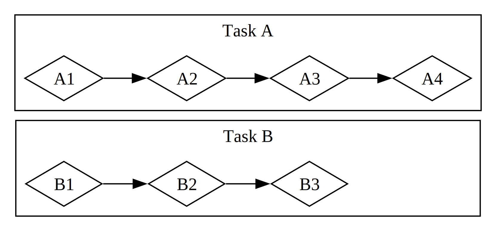

# 异步编程基础：Async、Await、Future 与 Stream

我们要求计算机执行的许多操作可能会花一段时间才能完成。如果能在等待这些长时间运行的进程完成的同时做点别的事情就好了。现代计算机提供了两种技术来同时处理多个操作：并行（parallelism）与并发（concurrency）。然而，我们程序的逻辑大多是以线性方式编写的。我们希望能够指定程序应当执行的操作，以及函数可能在哪些位置暂停、让程序的其他部分转而运行，而无需预先指定每段代码运行的确切顺序和方式。*异步编程（Asynchronous programming）* 是一种抽象，它让我们能够用潜在的暂停点和最终结果来表达代码，而协调的细节则由它来帮我们处理。

本章建立在第 16 章使用线程实现并行与并发的基础之上，介绍另一种编写代码的方法：Rust 的 future、stream，以及 `async` 和 `await` 语法，让我们能够表达操作如何以异步方式进行，此外还有实现异步运行时（asynchronous runtime）的第三方 crate——即管理和协调异步操作执行的代码。

让我们来看一个例子。假设你正在导出一个自己制作的家庭庆典视频，这个操作可能耗时几分钟到几小时不等。视频导出会尽可能多地占用 CPU 和 GPU 资源。如果你的电脑只有一个 CPU 核心，并且操作系统在导出完成之前不会暂停该导出——也就是说，如果它以*同步（synchronous）*方式执行导出——那么在该任务运行期间，你就无法在电脑上做任何其他事情。这将是相当令人沮丧的体验。幸运的是，你的计算机操作系统能够——而且确实——在后台不可见地频繁中断导出，让你能够同时完成其他工作。

现在假设你正在下载别人分享的视频，这也可能花一些时间，但不会占用太多 CPU 时间。在这种情况下，CPU 需要等待数据从网络到达。虽然一旦数据开始到达就可以开始读取，但可能还需要一些时间才能全部传输完毕。即使所有数据都已就位，如果视频非常大，加载全部数据也可能需要至少一两秒。这听起来可能不算什么，但对于每秒能执行数十亿次操作的现代处理器来说，这是非常长的时间。同样，你的操作系统会在后台不可见地中断你的程序，让 CPU 在等待网络调用完成的同时执行其他工作。

视频导出是*CPU 密集型（CPU-bound）*或*计算密集型（compute-bound）*操作的例子。它受限于计算机在 CPU 或 GPU 内的潜在数据处理速度，以及它能为此操作分配多少速度。视频下载是*I/O 密集型（I/O-bound）*操作的例子，因为它受限于计算机*输入输出（input and output）*的速度；它只能以数据通过网络传输的速度来进行。

在这两个例子中，操作系统的不可见中断提供了一种并发形式。不过，这种并发只发生在整个程序的层面：操作系统中断一个程序，让其他程序得以完成工作。在很多情况下，由于我们对程序的理解比操作系统要精细得多，我们能够发现操作系统看不到的并发机会。

例如，如果我们正在构建一个管理文件下载的工具，我们应该能够编写程序，使得开始一个下载不会锁死 UI，并且用户应该能够同时启动多个下载。然而，许多与网络交互的操作系统 API 是*阻塞（blocking）*的；也就是说，它们会阻塞程序的进展，直到正在处理的数据完全就绪。

> 注意：仔细想想，*大多数*函数调用都是这样工作的。然而，*阻塞*这个术语通常专用于与文件、网络或计算机上其他资源交互的函数调用，因为在这些情况下，单个程序会从操作变为*非*阻塞中获益。

我们可以通过为每个文件下载生成一个专用线程来避免阻塞主线程。然而，这些线程所使用的系统资源开销最终会成为一个问题。更好的做法是，调用本身就不阻塞，并且我们可以定义一些希望程序完成的任务，然后让运行时选择运行它们的最佳顺序和方式。

这正是 Rust 的 *async*（*异步*的缩写）抽象为我们提供的。在本章中，你将全面学习 async，涵盖以下主题：

- 如何使用 Rust 的 `async` 和 `await` 语法，以及如何通过运行时执行异步函数
- 如何使用 async 模型解决我们在第 16 章中遇到的一些相同挑战
- 多线程与 async 如何提供互补的解决方案，你可以在许多情况下将它们结合使用

不过，在我们了解 async 的实际工作原理之前，需要先绕一个小弯，讨论一下并行与并发之间的区别。

## 并行与并发

到目前为止，我们基本将并行和并发视为可以互换的概念。现在我们需要更精确地区分它们，因为在我们开始工作时，这些差异会显现出来。

考虑一个团队拆分软件项目工作的不同方式。你可以将多个任务分配给一个成员，为每个成员分配一个任务，或者混合使用这两种方法。

当一个人在几个不同任务都未完成之前同时处理它们时，这就是*并发（concurrency）*。实现并发的一种方式类似于在电脑上检出两个不同的项目，当你在一个项目上感到无聊或卡住时，就切换到另一个。你只是一个人，所以无法在完全相同的时刻在两个任务上取得进展，但你可以多任务处理，通过在它们之间切换来逐个取得进展（参见图 17-1）。

<figure>

<figcaption>图 17-1：并发工作流，在任务 A 和任务 B 之间切换</figcaption>

</figure>

当团队将一组任务拆分，让每个成员各自承担一个任务并独立完成时，这就是*并行（parallelism）*。团队中的每个人可以在完全相同的时刻取得进展（参见图 17-2）。

<figure>

<figcaption>图 17-2：并行工作流，任务 A 和任务 B 上的工作独立进行</figcaption>

</figure>

在这两种工作流中，你可能都需要在不同的任务之间进行协调。也许你以为分配给一个人的任务完全独立于其他人的工作，但实际上需要团队中的另一个人先完成他的任务。有些工作可以并行完成，但有些实际上是*串行（serial）*的：只能按顺序进行，一个任务接着另一个任务完成，如图 17-3 所示。

<figure>

<figcaption>图 17-3：部分并行的工作流，任务 A 和任务 B 上的工作独立进行，直到任务 A3 被任务 B3 的结果阻塞。</figcaption>

</figure>

同样地，你可能会意识到自己的某个任务依赖于你的另一个任务。此时你原本并发进行的工作也变成了串行的。

并行和并发也可以相互交叉。如果你得知某个同事因为等你完成某个任务而被卡住了，你大概会把所有精力集中在该任务上，以"解除阻塞"你的同事。你和同事不再能并行工作，你也不再能并发处理自己的各个任务。

同样的基本动态在软件和硬件中也发挥着作用。在只有一个 CPU 核心的机器上，CPU 一次只能执行一个操作，但它仍然可以并发工作。使用线程、进程和 async 等工具，计算机可以暂停一个活动并切换到其他活动，最终再循环回到第一个活动。在拥有多个 CPU 核心的机器上，它还可以并行工作。一个核心可以在执行一个任务的同时，另一个核心执行一个完全无关的任务，这些操作确实同时发生。

在 Rust 中运行 async 代码通常是以并发方式进行的。根据硬件、操作系统以及我们使用的 async 运行时（稍后将详细介绍 async 运行时），这种并发在底层也可能利用并行。

现在，让我们深入了解 Rust 中的异步编程到底是如何工作的。